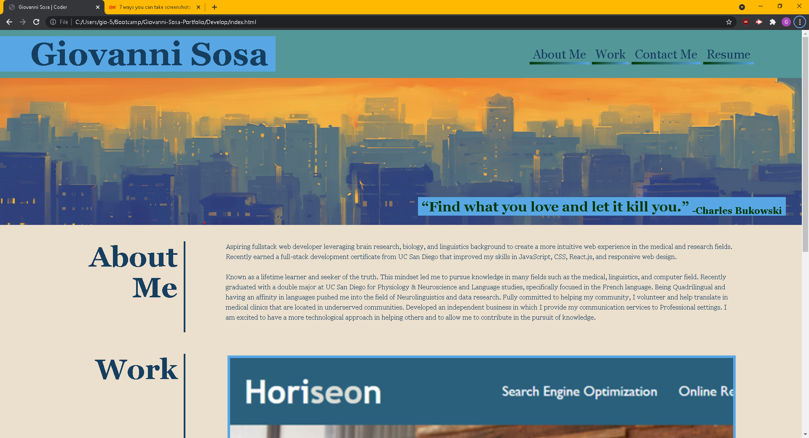
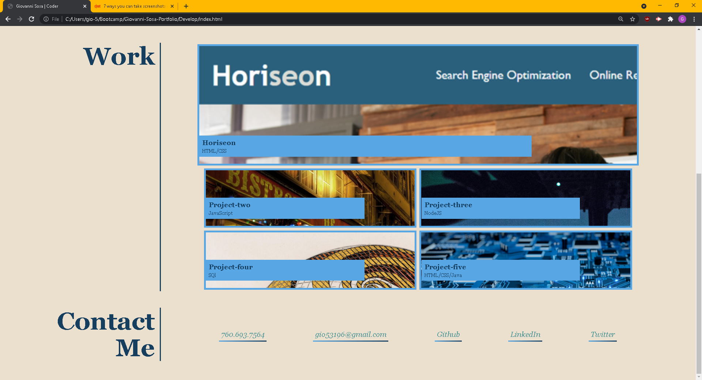
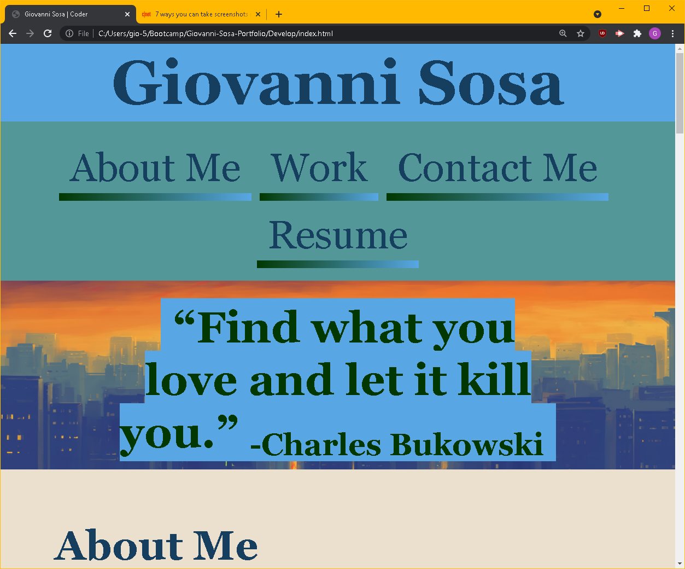
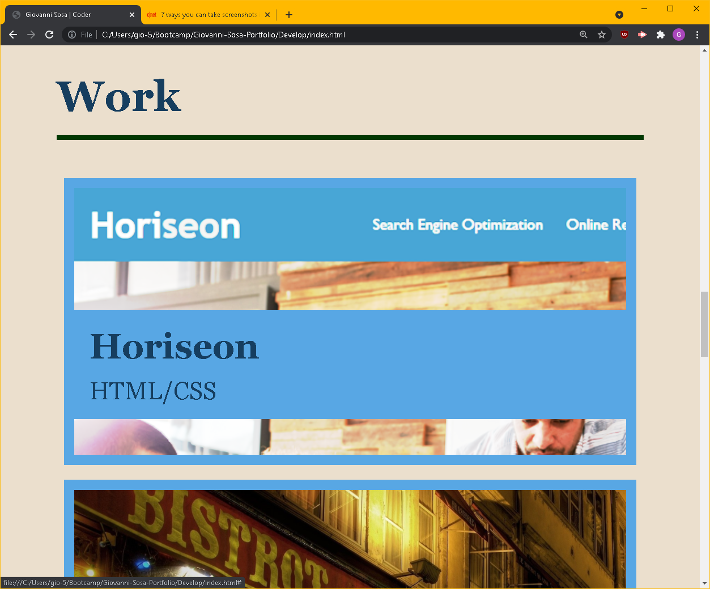
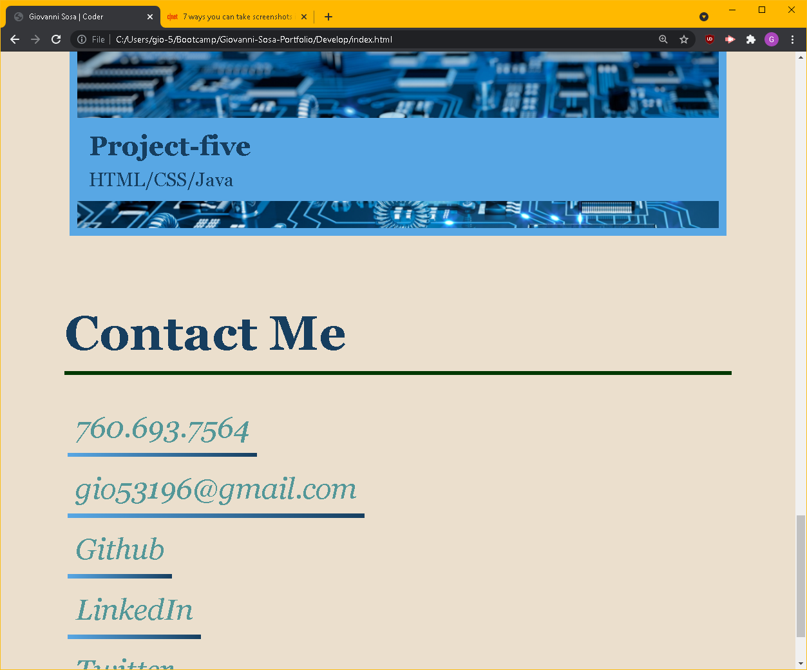

# GioSosaPortfolio
Personal Portfolio that Showcases Major Works through a Responsive Layout Designed Webpage

## Description
An Employer wants to view my personal portfolio landing page that is built with HTML and customized with advanced CSS. Implemented what we learned  throughout the week in order to create a webpage that can be improved as we finish more assignments.

### Completed Tasks
*Descriptive title added for webpage
*HTML Structure and CSS style sheet added
*Pseudoelements, media queries, flex properties, and more animated styling added
*Classes were labeled as concise as possible
*Comments were added to explain code for both html and css.

#### Link
![Link to Deployed Website] (https://gisosa531.github.io/Giovanni-Sosa-Portfolio/Develop/index.html)

![link to GitHub Repository] (https://github.com/gisosa531/Giovanni-Sosa-Portfolio)

##### References
* [https://www.w3schools.com/html/default.asp](https://www.w3schools.com/html/default.asp)
* [https://developer.mozilla.org/en-US/](https://developer.mozilla.org/en-US/)
* [https://webdesign.tutsplus.com/tutorialshow-to-build-a-portfolio-page-with-css-javascript--cms-32933] (https://webdesign.tutsplus.com/tutorials/how-to-build-a-portfolio-page-with-css-javascript--cms-32933)

### Images

